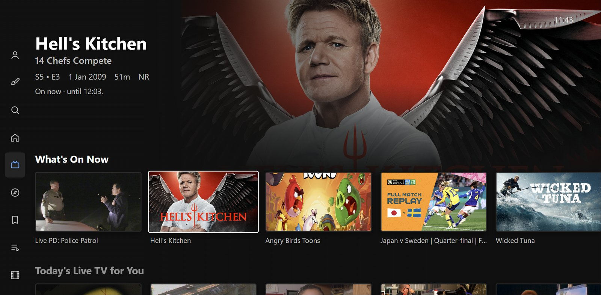
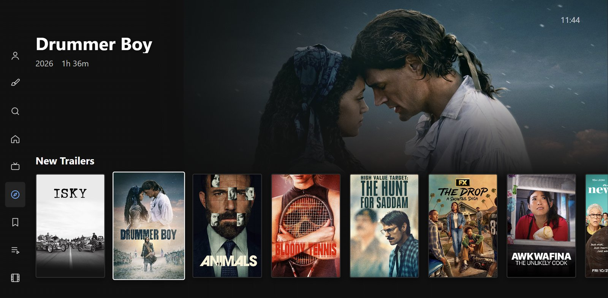
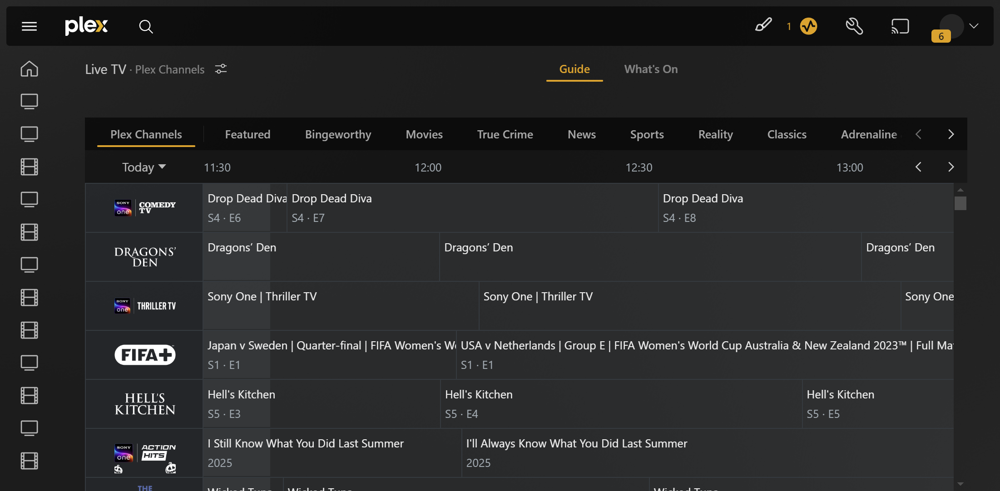
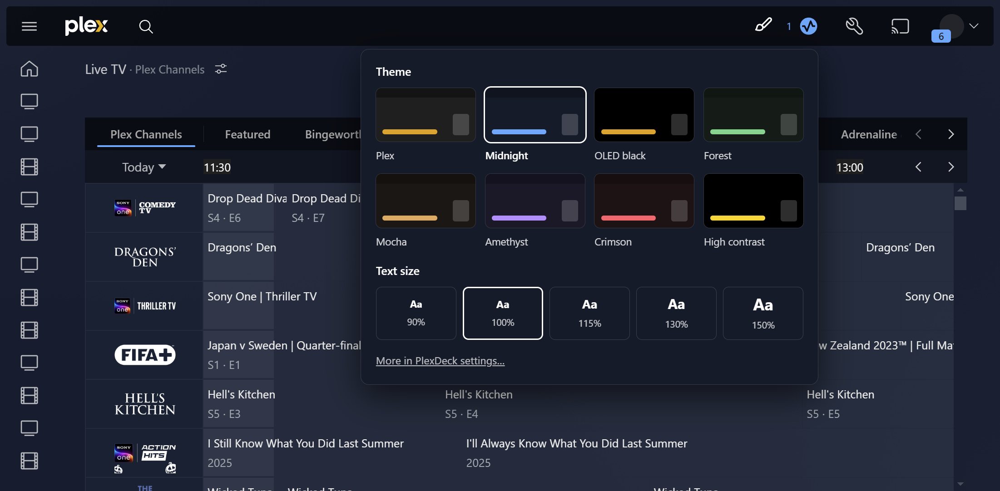
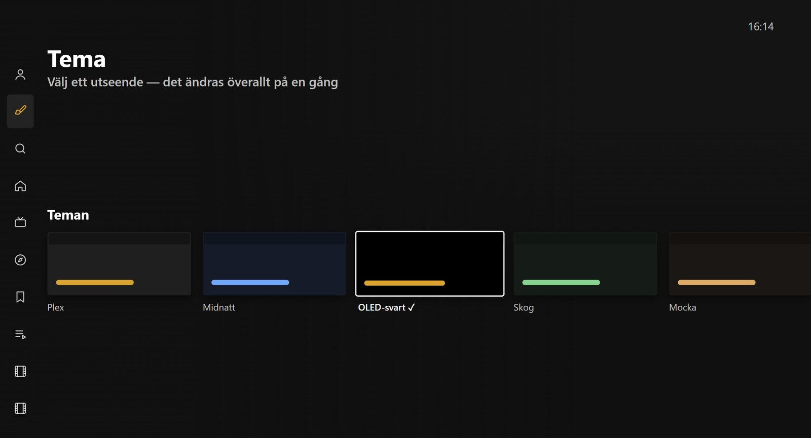
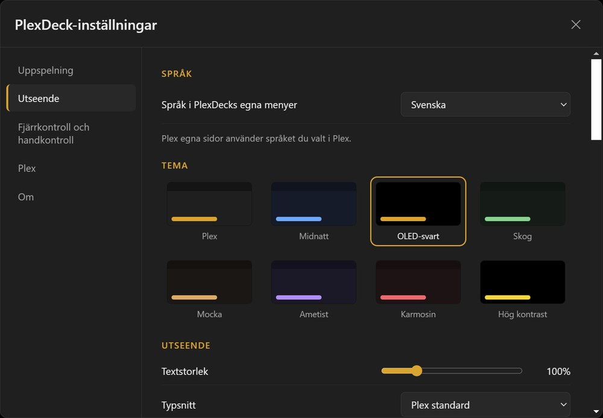

# PlexDeck

**An unofficial Windows app for Plex**, built for the desk *and* the couch:
everything the Plex web app can do, plus a controller-first **TV mode** modelled on
Plex's TV apps, a **native mpv player** that plays your files as they are, themes and
a stack of small extras.

> PlexDeck is a community project. It is **not made by, endorsed by or affiliated with
> Plex, Inc.** "Plex" is a trademark of Plex, Inc. You need your own Plex account and
> (for your own media) a Plex Media Server.

## Screenshots

| TV mode — Live TV | TV mode — Discover |
|---|---|
|  |  |
| **PC mode — Live TV guide** | **PC mode — themes (paintbrush)** |
|  |  |
| **TV mode in Swedish — themes** | **Settings in Swedish — languages** |
|  |  |

## Two modes

**PC mode** — the official Plex web app (app.plex.tv) in a clean desktop window:
your libraries, Discover, Watchlist, Live TV, settings and server management — with
PlexDeck's themes and extras on top.

**TV mode** — PlexDeck's own interface for a controller or remote, laid out like the
Plex app on a Shield / Fire TV / Google TV:

- side menu that loads libraries as you move through it, a hero that follows focus,
  rows that remember where you were, Back that works like the TV app
- Home, libraries (Recommended / Library / Collections / Categories, sort & filters),
  show pages with season tabs and episodes, movie pages, cast & crew, *More like this*,
  extras & trailers
- Search (your own media only), Watchlist (what's on your server), Playlists,
  Music with a Now Playing screen, Photos with a slideshow
- Live TV (Plex's free channels) and Discover
- Plex Home profiles with PIN
- theme music on show pages and an artwork screensaver

Switch with the **PC | TV** buttons in the title bar or **F10** — or let PlexDeck switch
by itself when you pick up a controller or move the mouse.

## Native player (mpv)

Your own videos play in [mpv](https://mpv.io) straight from your server — HEVC, 10-bit,
DTS / TrueHD, styled subtitles — without the server converting anything. In both modes.

- HDR to HDR screens, surround passthrough to an AV receiver (incl. TrueHD / Atmos / DTS-HD)
- match the screen's refresh rate to the video
- Skip Intro / Credits (optionally automatic after a delay you choose), Up Next,
  chapters, audio & subtitle tracks, playback speed, audio / subtitle sync
- subtitle size, colour, position and background; preferred audio & subtitle languages
- **mini player** (PC mode): keep watching in a corner of the window while you browse —
  drag it to another corner, three sizes, double-click for full size
- shows up in Windows' media overlay; the keyboard's media keys (play/pause, next,
  previous episode) work even when PlexDeck isn't in front

A built-in player (your server converts the video) is there as a fallback.

## Extras

- **Themes** — Plex, Midnight, OLED black, Forest, Mocha, Amethyst, Crimson, High contrast —
  applied everywhere, including Plex's older dialogs; quick switch with the paintbrush in
  the top bar. Text size and font.
- **Audio & subtitle tool** — set the exact audio / subtitle track for a whole show,
  season or movie at once (like PASTA).
- Controller support (PS4 / PS5 / Xbox), arrow-key navigation, mouse back/forward buttons
- Tray with play/pause controls (music and video), start with Windows, custom title bar, remembered window
- **Updates** — the installed app downloads and installs new versions itself (it asks
  first); the portable one tells you when there's a new version
- **Languages** — PlexDeck's own menus in English, Svenska, Deutsch, Español and Français
  (follows Windows, or pick one in Settings → Appearance); Plex's pages follow your Plex language
- **Settings backup** — export / import your PlexDeck settings (Settings → About);
  your sign-in and server address are never in the file
- Works fine with a Windows contrast theme on

## Download

Grab the latest from [Releases](https://github.com/Farathim89/plexdeck/releases):

- `PlexDeck-Setup-<version>.exe` — installer (Start Menu & desktop shortcuts, uninstaller)
- `PlexDeck-Portable-<version>.zip` — no install: unzip it to a folder of its own and run
  `PlexDeck.exe`. Everything stays in that folder (settings in `plexdeck-data` next to it),
  nothing goes to Temp or AppData — you can carry it on a USB stick

Sign in to Plex on first start. PlexDeck checks GitHub for new versions and shows an
**Update** button in the title bar when one is out (Help → *Check for updates…* checks now).
The installed app updates itself with one click; for the portable one, unzip the new
version over the old folder (your `plexdeck-data` folder stays as it is).

Coming from the older single-file `PlexDeck-Portable-x.exe`? Unzip the new version into its
folder and move your `plexdeck-data` folder in next to `PlexDeck.exe`.

### "Windows protected your PC"?

PlexDeck isn't code-signed yet, so SmartScreen shows a warning for new downloads.
Click **More info → Run anyway**. To check that your download is the real one, compare
its SHA-256 with `SHA256SUMS.txt` on the release page:

```powershell
Get-FileHash .\PlexDeck-Setup-<version>.exe -Algorithm SHA256
```

Every release is built from this repository; you can also [build it yourself](#building).

## Building

Windows, [Node.js](https://nodejs.org) 20+.

```bash
npm install
winget install --id shinchiro.mpv -e
npm run vendor-mpv
npm start
```

`npm run dist` builds the installer and the portable exe into `dist/`.

## Translating

PlexDeck's texts live in `locales/<language>.json`, keyed by the English text
(`"Settings": "Inställningar"`). Anything a file doesn't have stays English.

1. Run `node scripts/i18n-extract.js` — it writes `locales/template.json` with every text
   and shows how complete each language is (`--verbose` lists what's missing).
2. Copy `template.json` to e.g. `locales/it.json`, set `"_name": "Italiano"` and fill in
   the values. Keep `{placeholders}` and `<b>tags</b>` as they are.
3. Pick the language in Settings → Appearance (or let it follow Windows) and open a pull request.

## Credits

- [mpv](https://mpv.io) (GPL-2.0-or-later), Windows build by
  [shinchiro](https://github.com/shinchiro/mpv-winbuild-cmake)
- [hls.js](https://github.com/video-dev/hls.js) (Apache-2.0)
- [Electron](https://www.electronjs.org) (MIT)

## License

PlexDeck is free software: **GNU General Public License v3.0 or later** — see [LICENSE](LICENSE).
